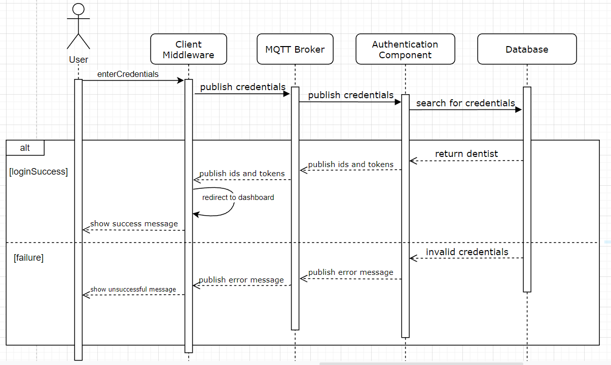

# Authentication Component for the Dentismo Web Application

## Description
This repository is required for logging in as the dentist as it handles the login logic for the dentist login. It takes in credentials from the user over the MQTT Protocol and checks them via the database. Upon successful credentials, the component returns the id, clinicId, and token from the logged in dentist which are saved in the localstorage of the client for later use. The component also provides feedback if the login was unsuccesful.

## Badges - TODO
On some READMEs, you may see small images that convey metadata, such as whether or not all the tests are passing for the project. You can use Shields to add some to your README. Many services also have instructions for adding a badge.

## Visuals
### Sequence Diagram
This sequence diagram reflects the use case of a user trying to login to their account via the Login Page in the Client.


## Installation
1. Clone Repository
2. Via the terminal navigate to the cloned repository
3. Run ```npm i``` to download all required packages for running the app
4. Run ```npm start``` to run the component
5. Try logging in via the client to see successful interaction between the two components

## Usage
Use examples liberally, and show the expected output if you can. It's helpful to have inline the smallest example of usage that you can demonstrate, while providing links to more sophisticated examples if they are too long to reasonably include in the README.

## Support
Developer of the component: [@zsolnai](https://git.chalmers.se/zsolnai) <br>
Clickable email: <a href="mailto:niru23@yahoo.com?Subject=Authentication%20Component" target="_blank">georg.zsolnai123@gmail.com</a>

## Roadmap
None for the forseeable future

## Contributing
I am open to contributions, however, they must be requested via a merge request and a subsequent email explaining:
- What does this fix
- Why its beneficial for the component
- If the person is willing to continue to support this fix/features

## Authors and acknowledgment
Lead Developer for the Component: @zsolnai

## License - TODO
For open source projects, say how it is licensed.

## Project status
Development has ceased until further notice or a bug fix has appeared
