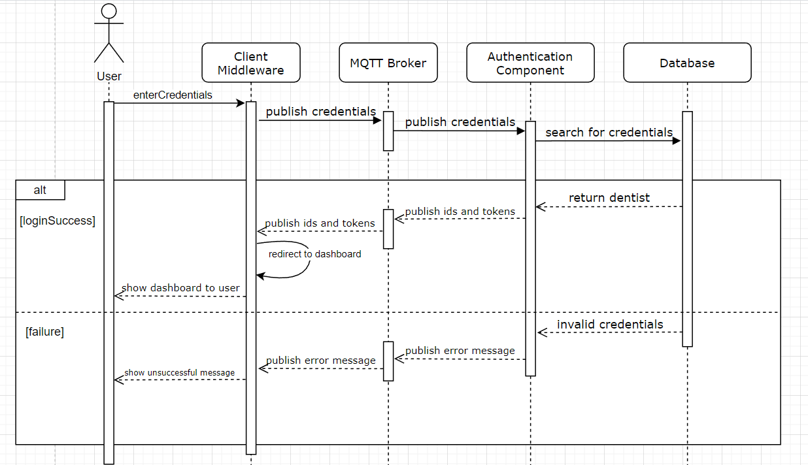

# Authentication Component for the Dentismo Web Application

## Description
This repository is required for logging in as the dentist as it handles the login logic for the dentist login. It takes in credentials from the user over the MQTT Protocol and checks them via the database. Upon successful credentials, the component returns the id, clinicId, and token from the logged in dentist which are saved in the localstorage of the client for later use. The component also provides feedback if the login was unsuccesful.

## Badges - TODO
On some READMEs, you may see small images that convey metadata, such as whether or not all the tests are passing for the project. You can use Shields to add some to your README. Many services also have instructions for adding a badge.

## Visuals
### Sequence Diagram
This sequence diagram reflects the use case of a user trying to login to their account via the Login Page in the Client.


## Installation
1. Clone Repository
2. Via the terminal navigate to the cloned repository
3. Run ```npm i``` to download all required packages for running the app
4. Run ```npm start``` to run the component
5. Try logging in via the client to see successful interaction between the two components

## Usage
This component is all about receiving credentials from the user and checking them via the backend of the system to make sure that the credentials exisit in the database and verify that the person is allowed to login. An example of what can be sent to the component looks like this:
```
{
    email: "example123@gmail.com"
    password: "24hjwb134bwnbj13b4jdwb234"
}
```
In the example above, the password arrives at the component hashed using the bcrypt library so as to never reveal the password in any package being sent from component to component. 

There are two output examples. One being the success message:
```
{
    id: "q3423hgw39234rfn23"
    token: "24df7s89df78sd7f9ssd0f7ds"
    clinicId: "1dsfsdg889sdf8f9dfsf"
}
```
Here it sends back the relevant information needed for fetching the relevant bookings and dentist when progressing to the dashboard page. These details are not shown to the user in the frontend but are saved to localstorage for safe keeping and retrieval for checking if person is logged in and data queries

Or in the case that the credentials do not exist in the database
```
{
    message: "Incorrect Credentials"
}
```
This message is what is not shown directly to the user but is checked for by the system to show the apporiopriate UI response upon the unsuccessful login attempt
## Support
Developer of the component: [@zsolnai](https://git.chalmers.se/zsolnai) <br>
Clickable email: <a href="mailto:niru23@yahoo.com?Subject=Authentication%20Component" target="_blank">georg.zsolnai123@gmail.com</a>

## Roadmap
None for the forseeable future

## Contributing
I am open to contributions, however, they must be requested via a merge request and a subsequent email explaining:
- What does this fix
- Why its beneficial for the component
- If the person is willing to continue to support this fix/features

## Authors and acknowledgment
Lead Developer for the Component: @zsolnai

## License - TODO
For open source projects, say how it is licensed.

## Project status
Development has ceased until further notice or a bug fix has appeared
